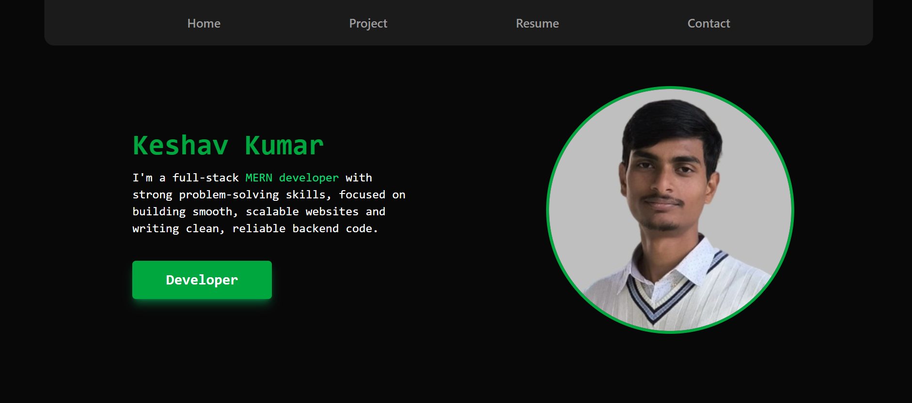

# 💼 Personal Portfolio Website

This is my personal portfolio website built using **React + Vite**, styled with **Tailwind CSS** and **DaisyUI**, and includes a responsive contact form powered by **Formspree**.

## 🚀 Tech Stack

- **Frontend**: [React](https://reactjs.org/) (with [Vite](https://vitejs.dev/))
- **Styling**: [Tailwind CSS](https://tailwindcss.com/), [DaisyUI](https://daisyui.com/)
- **Form Handling**: [Formspree](https://formspree.io/)
- **Hosting**: Netlify

## 🌐 Features

- ✅ Fully **responsive** design for all screen sizes
- 🎨 Clean UI with DaisyUI component library
- 📂 Projects section to showcase your work
- 📄 Downloadable resume (if included)
- 📬 Contact form that sends messages via Formspree

## 📸 Preview

Add a screenshot or live link here: 

🔗 **Live Site**: https://keshavks.netlify.app

